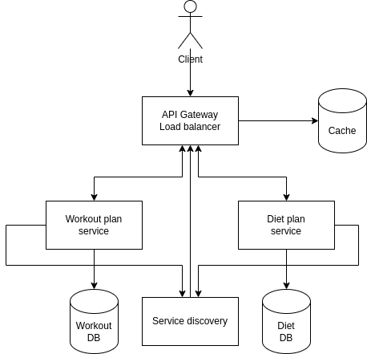

# Workout application

## Assess Application Suitability

Why distributed systems are necessary for the implementation of such an application:

- Scalability: A workout application needs to be able to scale to meet the needs of a large number of users. Distributed systems can help to achieve this by distributing the workload across multiple servers.
- Reliability: A workout application needs to be reliable and available to users at all times. Distributed systems can help to achieve this by providing redundancy and failover mechanisms.
- Security: A workout application needs to be secure and protect user data from unauthorized access. Distributed systems can help to achieve this by using encryption and other security measures.
- Performance: A workout application needs to be performant and responsive to user requests. Distributed systems can help to achieve this by distributing the workload across multiple servers and using caching mechanisms.
- Distributed systems can be used to implement new features and functionality in a workout application more quickly and easily. For example, distributed systems can be used to implement a recommendation engine that suggests personalized workout programs and nutrition plans to users based on their individual needs and goals.

Real-world examples:
- Nike Training Club is a fitness app from Nike that offers a variety of workouts for all levels of fitness. It also includes a personalized training plan feature that helps users create a workout routine that is tailored to their individual needs and goals. Nike Training Club is built using a microservices architecture, which allows it to deliver a personalized experience to each user.
- MyFitnessPal is a fitness app that helps users track their calorie intake and exercise. It also includes a variety of features to help users stay motivated, such as food logging, barcode scanning, and social media integration. MyFitnessPal is also built using a microservices architecture, which allows it to scale and support a large user base.

## Service Boundaries



## Choose Technology Stack and Communication Patterns
### Technology Stack:
- Service1 - C#, .Net framework
- Service2 - C#, .Net framework
- API Gateway - Python, Flask framework

gRPC supports both python and c#.

### C# for microservices:
- C# is a powerful and versatile language that is well-suited for developing microservices. It is also a popular language in the .NET ecosystem, which provides a rich set of tools and libraries for building microservices-based applications.
- C# has a number of features that make it easy to develop microservices, such as support for asynchronous programming and dependency injection. This can help to write cleaner and more maintainable code.
- C# is a performant language, which is important for microservices that need to handle a high volume of traffic.
- C# has a large and active community, which means that there is a lot of support available if you need help.

### Python for API gateway:
- Python is a lightweight and easy-to-learn language, which makes it a good choice for developing an API gateway.
- Python is a versatile language that can be used for a variety of tasks, such as routing requests, and transforming data.
- Python has a rich ecosystem of libraries and frameworks for developing API gateways.
- Python is a popular language in the DevOps community, which means that there is a lot of support available for deploying and managing Python-based applications.


### Communication Patterns:
- gRPC between gateway and services
- RESTful APIs (synchronous communication) between client and gateway

## Design Data Management

The system will have separate databases for each service.

### Endpoints:
- Gateway:

POST /workouts\
GET /workouts/{user_id}\
PUT /workouts/{workout_id}\
DELETE /workouts/{workout_id}

POST /diets\
GET /diets/{user_id}\
PUT /diets/{diets_id}\
DELETE /diets/{diets_id}

- Workout service:

create_workout_plan\
read_workout_plan\
update_workout_plan\
delete_workout_plan


- Diet service:

create_diet_plan\
read_diet_plan\
update_diet_plan\
delete_diet_plan\

- get_service_registry_info
### Define the data to be transferred, including its format and type

Request:
```proto
syntax = "proto3";

package com.example.service_registry;

message GetServiceRegistryInfoRequest {
}
```
Response:
```proto
syntax = "proto3";

package com.example.service_registry;

message GetServiceRegistryInfoResponse {
  repeated ServiceInfo services = 1;
}

message ServiceInfo {
  string name = 1;
  string address = 2;
  string health_status = 3;
}
```
- create_workout_plan

Request:
```proto
syntax = "proto3";

package com.example.workout_app;

message CreateWorkoutPlanRequest {
  string user_id = 1;
  string name = 2;
  repeated WorkoutExercise exercises = 3;
}

message WorkoutExercise {
  string name = 1;
  int32 sets = 2;
  int32 reps = 3;
}
```
Response:
```proto
syntax = "proto3";

package com.example.workout_app;

message CreateWorkoutPlanResponse {
  string id = 1;
}
```
- read_workout_plan

Request:

```proto
syntax = "proto3";

package com.example.workout_app;

message ReadWorkoutPlanRequest {
  string id = 1;
}
```
Response:
```proto
syntax = "proto3";

package com.example.workout_app;

message ReadWorkoutPlanResponse {
  WorkoutPlan workout_plan = 1;
}

message WorkoutPlan {
  string id = 1;
  string user_id = 2;
  string name = 3;
  repeated WorkoutExercise exercises = 4;
}
```

- update_workout_plan

Request:
```proto
syntax = "proto3";

package com.example.workout_app;

message UpdateWorkoutPlanRequest {
  string id = 1;
  WorkoutPlan workout_plan = 2;
}

message WorkoutPlan {
  string id = 1;
  string user_id = 2;
  string name = 3;
  repeated WorkoutExercise exercises = 4;
}

message WorkoutExercise {
  string name = 1;
  int32 sets = 2;
  int32 reps = 3;
}
```
Response:
```proto
syntax = "proto3";

package com.example.workout_app;

message UpdateWorkoutPlanResponse {
}
```

- delete_workout_plan

Request:
```proto
syntax = "proto3";

package com.example.workout_app;

message DeleteWorkoutPlanRequest {
  string id = 1;
}
```

Response:
```proto
syntax = "proto3";

package com.example.workout_app;

message DeleteWorkoutPlanResponse {
}
```

- create_diet_plan

Request:

```proto
syntax = "proto3";

package com.example.workout_app;

message CreateDietPlanRequest {
  string user_id = 1;
  repeated Meal meals = 2;
}

message Meal {
  string name = 1;
  repeated Food foods = 2;
}

message Food {
  string name = 1;
  int32 calories = 2;
  int32 protein = 3;
  int32 carbs = 4;
  int32 fat = 5;
}
```
Response:

```proto
syntax = "proto3";

package com.example.workout_app;

message CreateDietPlanResponse {
  string id = 1;
}
```
- read_diet_plan

Request:
```proto
syntax = "proto3";

package com.example.workout_app;

message ReadDietPlanRequest {
  string id = 1;
}
```
Response:
```proto
syntax = "proto3";

package com.example.workout_app;

message ReadDietPlanResponse {
  DietPlan diet_plan = 1;
}

message DietPlan {
  string id = 1;
  string user_id = 2;
  repeated Meal meals = 3;
}

message Meal {
  string name = 1;
  repeated Food foods = 2;
}

message Food {
  string name = 1;
  int32 calories = 2;
  int32 protein = 3;
  int32 carbs = 4;
  int32 fat = 5;
}
```

- update_diet_plan

Request:

```proto
syntax = "proto3";

package com.example.workout_app;

message UpdateDietPlanRequest {
  string id = 1;
  DietPlan diet_plan = 2;
}

message DietPlan {
  string id = 1;
  string user_id = 2;
  repeated Meal meals = 3;
}

message Meal {
  string name = 1;
  repeated Food foods = 2;
}

message Food {
  string name = 1;
  int32 calories = 2;
  int32 protein = 3;
  int32 carbs = 4;
  int32 fat = 5;
}
```
Response:
```proto
syntax = "proto3";

package com.example.workout_app;

message UpdateDietPlanResponse {
}
```
- delete_diet_plan

Request:

```proto
syntax = "proto3";

package com.example.workout_app;

message DeleteDietPlanRequest {
  string id = 1;
}
```
Response:
```proto
syntax = "proto3";

package com.example.workout_app;

message DeleteDietPlanResponse {
}
```
## Set Up Deployment and Scaling

The application will\ containerized using Docker. Docker is a popular platform for containerization, which is a technology that allows you to package and run applications and their dependencies in isolated environments called containers. 